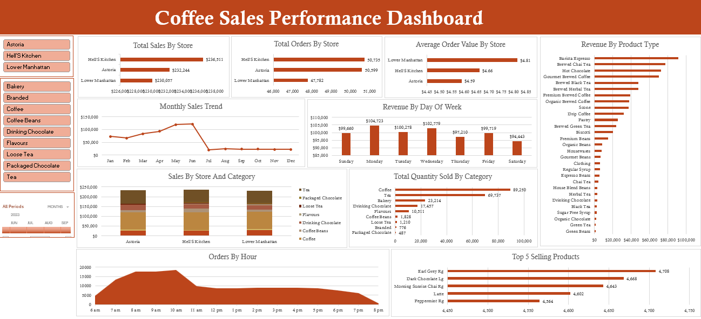

# Coffee Shop Sales Analysis Project

## Problem Statement
A coffee shop chain with three locations needed to understand their sales performance, customer behavior patterns, and operational efficiency to optimize business strategy and resource allocation.

## Project Objective
To analyze sales data across three coffee shop locations, identify performance trends, and provide data-driven recommendations to improve revenue, customer satisfaction, and operational efficiency.

## My Approach
- **Data Preparation**: Cleaned and standardized sales data, added calculated columns for revenue and time-based analysis
- **Data Analysis**: Conducted comprehensive analysis across store performance, product sales, and time patterns
- **Business Insights**: Translated findings into actionable recommendations for management
- **Data Visualization**: Created interactive Excel dashboard with pivot tables and charts

## Tools and Techniques Used
- **Microsoft Excel**: For data analysis, calculations, and visualization
- **Pivot Tables**: For dynamic data summarization and trend analysis
- **Data Analysis**: Performance metrics, product analysis, and time-based patterns
- **Data Visualization**: Charts and dashboards for clear business insights

## Key Performance Indicators (KPIs)
1. **Total Sales by Store Location**: Revenue generated at each store
2. **Total Orders by Store Location**: Number of transactions processed
3. **Average Order Value by Store**: Average spending per transaction
4. **Total Quantity Sold by Product Category**: Sales volume by category
5. **Top 5 Selling Products**: Most popular items by units sold
6. **Revenue by Product Type**: Income generated by product category
7. **Sales Trend Over Time**: Daily and monthly sales patterns
8. **Orders by Hour of Day**: Customer traffic throughout the day
9. **Revenue by Day of Week**: Sales distribution across weekdays

## Dashboard

## Key Insights

### Insight 1: Store Performance Imbalance
**Finding**: All three stores show similar total sales ranging from $230,000 to $236,000 and process comparable order volumes between 47,000 and 50,000 transactions. However, Lower Manhattan achieves a significantly higher Average Order Value of $4.81 while serving the fewest customers.

**Business Impact**: Lower Manhattan demonstrates superior efficiency in generating value from each customer transaction. The other locations rely on higher customer volume to achieve similar sales totals, indicating potential inefficiencies in customer value optimization.

**Recommendations**:
- Conduct detailed analysis of Lower Manhattan's operations to identify success factors
- Implement cross-store training programs to transfer best practices
- Develop targeted customer retention strategies for Lower Manhattan

### Insight 2: Product Strategy Mismatch
**Finding**: Coffee and Tea categories collectively drive 67% of total revenue, generating $465,000 combined. However, the top five selling products are predominantly tea items, with only one coffee product (Latte) appearing on the list.

**Business Impact**: The analysis reveals underutilization of the coffee category's revenue potential. While coffee generates substantial income, its individual products lack the sales volume achieved by tea products, suggesting missed opportunities for category growth.

**Recommendations**:
- Develop premium coffee offerings to capitalize on the category's strong revenue performance
- Create bundled deals combining coffee and tea products
- Enhance coffee product visibility through improved marketing campaigns

### Insight 3: Operational Inefficiencies
**Finding**: Sales demonstrate a dramatic 82% decrease after June, dropping from $122,000 in June to $21,000 in July. Additionally, order analysis reveals that 44% of daily transactions occur within a narrow four-hour morning window from 7-10 AM.

**Business Impact**: The extreme concentration of orders during morning hours leads to significant underutilization of staff and resources during afternoon and evening periods. The substantial July sales decline represents either a seasonal pattern requiring preparation or an operational issue needing immediate attention.

**Recommendations**:
- Investigate the causes behind the July sales decrease
- Implement afternoon promotional strategies to distribute demand more evenly
- Develop flexible staffing models to optimize resource allocation during peak traffic periods

## Summary
This analysis identifies three primary opportunities for business improvement: standardizing store performance by implementing Lower Manhattan's customer value optimization practices, enhancing coffee category monetization, and addressing operational challenges including seasonal fluctuations and peak-hour concentration. These findings provide a data-driven foundation for optimizing both revenue generation and operational efficiency across the coffee shop network.

The project demonstrates how Excel-based analysis can transform raw sales data into actionable business intelligence, enabling management to make informed decisions about operations, marketing, and resource allocation.
